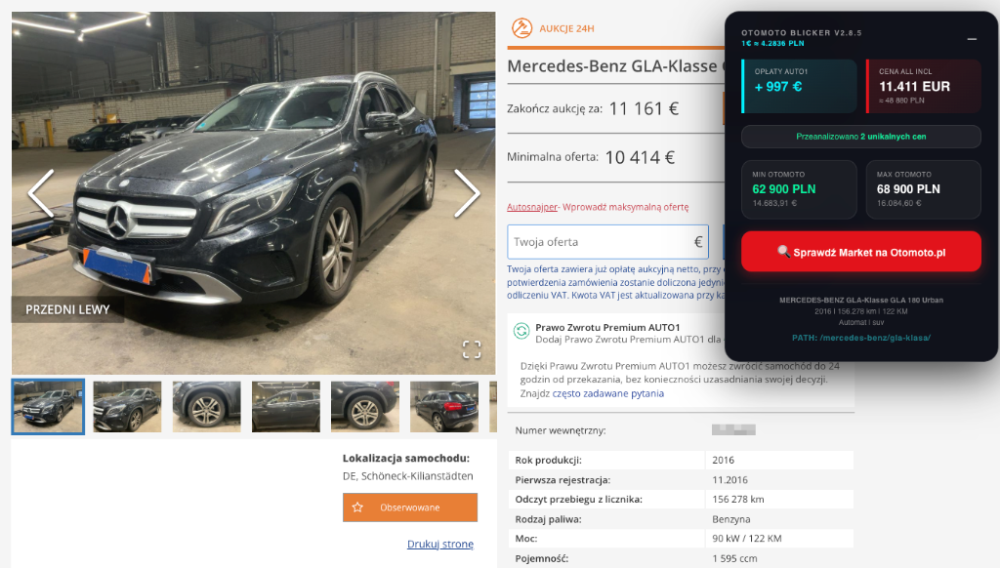

# 🚗 Otomoto Blicker (v2.8.5)

> **Otomoto Blicker** to profesjonalne rozszerzenie Chrome stworzone z myślą o polskich dealerach samochodowych licytujących na platformie **Auto1.com**. 

### 💡 Po co to zrobiliśmy?
Import aut z zagranicy wymaga szybkiej decyzji i precyzyjnych obliczeń. Nasze narzędzie eliminuje potrzebę ręcznego sprawdzania cen na Otomoto oraz wertowania tabel opłat. Wszystko, czego potrzebujesz do trafnej licytacji, widzisz bezpośrednio na stronie pojazdu.

---

## 📸 Podgląd

*Panel automatycznie wstrzyknięty na stronę Auto1 (Lokalizacja DE, Mercedes GLA).*

---

## ✨ Co robi to rozszerzenie?

1.  **Cena "All-Inclusive" (EUR & PLN)**:
    - Automatycznie sumuje cenę licytacji oraz wszystkie koszty dodatkowe (Handling + Dokumenty).
    - **Ważne**: Rozszerzenie wie, że *Auktionsgebühr* (opłata aukcyjna) jest już zawarta w Twoim zakładanym budżecie/ofercie na stronie, więc dolicza jedynie brakujące koszty stałe.
2.  **Inteligentny Cennik 2026**:
    - Rozpoznaje kraj pochodzenia auta (np. Niemcy, Holandia, Hiszpania).
    - Stosuje stawki z oficjalnego cennika **Auto1 2026** dla 12 krajów Europy.
3.  **Błyskawiczny Research Rynkowy**:
    - Pobiera statystyki z **Otomoto.pl** dla identycznego modelu i rocznika.
    - Pokazuje Min/Max cenę rynkową w PLN, co pozwala natychmiast ocenić potencjalny zysk.
4.  **Profesjonalne Linki**:
    - Generuje precyzyjne ścieżki (np. `/seg-combi/`), które prowadzą prosto do filtrowanych wyników na Otomoto bez gubienia parametrów.

---

## 💶 Tabela opłat Auto1 (2026)

Rozszerzenie automatycznie rozpoznaje kraj pochodzenia auta i dolicza odpowiednie koszty stałe (Handling + Dokumenty). Poniżej zestawienie stawek netto:

| Kraj | Handling | Dokumenty (Eksport) | Dokumenty (Krajowe) |
| :--- | :--- | :--- | :--- |
| **Polska (PL)** | 169 € | 109 € | 79 € |
| **Niemcy (DE)** | 289 € | 159 € | 119 € |
| **Holandia (NL)** | 269 € | 205 € | 109 € |
| **Belgia (BE)** | 289 € | 159 € | 119 € |
| **Francja (FR)** | 309 € | 109 € | 99 € |
| **Włochy (IT)** | 229 € | 399 € | 339 € |
| **Hiszpania (ES)** | 269 € | 265 € | 199 € |
| **Austria (AT)** | 299 € | 169 € | 159 € |

> **Uwaga**: Opłata aukcyjna (*Auktionsgebühr*) jest zmienna i pobierana bezpośrednio z systemu Auto1 — rozszerzenie zawsze pokazuje ją zgodnie z rzeczywistością.

---

## ⚙️ Automatyczne Filtry (Co ustawiamy?)

Klikając przycisk "Sprawdź Market", rozszerzenie otwiera Otomoto z już ustawionymi filtrami, aby wyniki były jak najbardziej trafne:
- **Model & Marka**: Precyzyjne mapowanie (np. BMW 5 GT nie pomyli się z Serią 5).
- **Rok produkcji**: Od rocznika auta do teraz (np. auto 2019 → filtruje 2019-2026).
- **Paliwo**: Diesel, Benzyna, Hybryda lub Elektryk — zgodnie ze specyfikacją na Auto1.
- **Nadwozie**: Automatyczne wykrywanie (Kombi, Sedan, SUV, Hatchback).
- **Skrzynia biegów**: Tylko jeśli jest wyraźnie zaznaczona w specyfikacji.
- **Stan**: Tylko auta nieuszkodzone.

---

## 🛠️ Instalacja Krok po Kroku

1.  **Pobierz kod**: Kliknij zielony przycisk `Code` na górze strony i wybierz `Download ZIP`, a następnie rozpakuj go na dysku (lub użyj `git clone`).
2.  **Otwórz Chrome**: Wpisz w pasku adresu `chrome://extensions/`.
3.  **Tryb deweloperski**: Włącz przełącznik "Tryb deweloperski" w prawym górnym rogu.
4.  **Załaduj rozszerzenie**: Kliknij przycisk "Załaduj rozpakowane" (Load unpacked) i wybierz folder `otomoto-blicker`.
5.  **Gotowe**: Wejdź na Auto1.com, zaloguj się i otwórz dowolną ofertę. Panel pojawi się sam!

---

## 🪄 Skróty Klawiszowe & Porady
- **Panel można zwijać**: Kliknij ikonkę "-" w prawym górnym rogu panelu, aby go zminimalizować do małego logo "OB".
- **Odświeżanie**: Jeśli cena na Auto1 się zmieni (licytujesz), panel zaktualizuje wyliczenia "All-Incl" w czasie rzeczywistym.

---

## ⚖️ Licencja & Bezpieczeństwo

Rozszerzenie działa lokalnie w Twojej przeglądarce. Nie przesyła danych o Twoich licytacjach na zewnętrzne serwery. 

MIT © 2026 **Otomoto Blicker Team**
