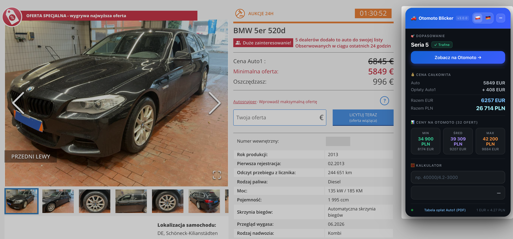

# ⚡ Auto1-Blicker
## *Automatyczne porównanie cen Auto1 z Otomoto.pl i mobile.de*

<div align="center">
  
  
</div>

---

# 🇵🇱 **POLSKI**

## 📋 Czym jest Auto1-Blicker?

**Auto1-Blicker** to rozszerzenie do przeglądarki Chrome, które automatycznie porównuje ceny samochodów z **Auto1.com** z lokalnym rynkiem (**Otomoto.pl** dla Polski, **mobile.de** dla Niemiec). 

### 🎯 Dlaczego zostało stworzone?

Jeśli pracujesz w branży handlu samochodami, wiesz ile czasu zajmuje:
- ⏱️ Porównywanie cen różnych pojazdów
- 🖱️ Ręczne wpisywanie filtrów na Otomoto i mobile.de
- 🧮 Liczenie marży i kosztów sprowadzenia
- 💱 Przeliczanie walut (EUR → PLN)
- 📊 Analiza rynku i wycena konkurencji

**Auto1-Blicker** automatyzuje wszystkie te zadania w jednym panelu! 🚀

---

## ✨ Główne Features

| Funkcja | Opis |
|---------|------|
| **🎯 Inteligentne dopasowanie modeli** | Automatycznie mapuje model z Auto1 na Otomoto/mobile.de (wykorzystuje zaawansowane slug-mapping) |
| **💰 Kalkulator całkowitego kosztu** | Oblicza dokładną cenę końcową: Auto1 + opłaty Auto1 + VAT, według oficjalnego cennika |
| **📊 Analiza rynku w real-time** | Pobiera na żywo ceny min/średnią/max z Otomoto lub mobile.de dla danego modelu |
| **🧮 Kalkulator wyrażeń** | Wbudowany kalkulator: `40000/4.2-3000` - oblicza marżę na paliwa, serwis, itp. |
| **🌍 Ponad 12 krajów** | Obsługuje oficjalne opłaty Auto1 dla: PL, DE, AT, BE, DK, ES, FI, FR, IT, NL, PT, SE |
| **💱 Kursy walut** | Pobiera aktualne kursy EUR/PLN z API NBP (odświeżane co godzinę) |
| **🔄 Przełączanie rynków** | Łatwy switch między rynkiem polskim (Otomoto) a niemieckim (mobile.de) |
| **⚙️ Automatyczne formatowanie** | Czytelne wyświetlanie cen i danych, gotowe do wzięcia do kalkulacji |

---

## 🚀 Instalacja

### 📌 Wersja prosta (dla każdego) - bez terminala!

1. **Pobierz projekt:**
   - Wejdź na: https://github.com/xdynamic/auto1-blicker
   - Kliknij zielony przycisk **"Code"** → **"Download ZIP"**
   - Rozpakuj plik ZIP na pulpicie (prawy klik → Rozpakuj)

2. **Włóż do Chrome:**
   - Otwórz Chrome i wpisz: **`chrome://extensions/`** w pasek adresu
   - W **prawym górnym rogu** włącz **"Tryb dewelopera"**
   - Kliknij **"Załaduj rozpakowane"**
   - Wskaż folder **`auto1-blicker-main`** (ten co rozpakował się z ZIP)
   - **Gotowe! 🎉**

3. **Testuj:**
   - Otwórz https://auto1.com/de/car/... (jakąkolwiek ofertę)
   - Panel Auto1-Blickera pojawi się po prawej stronie

---

### 💻 Wersja zaawansowana (z terminala/Git)

**Wymagania:**
- Google Chrome (wersja 88+)
- Git zainstalowany

**Kroki:**
```bash
git clone https://github.com/xdynamic/auto1-blicker.git
cd auto1-blicker
```

Potem postępuj jak w wersji prostej pkt. 2 i 3 (użyj folderu `auto1-blicker`)

---

## 📖 Jak Używać?

### Na Auto1.com (Rynek Polski - Otomoto)
1. Otwórz jakąkolwiek ofertę samochodu na Auto1.com
2. Panel pojawi się z prawej strony
3. Wtyczka **automatycznie**:
   - Odczyta markę, model, rok, przebieg, silnik
   - Wyszuka to auto na Otomoto.pl
   - Pokaże statystyki cen (min/średnia/max)
   - Obliczy całkowity koszt z opłatami Auto1 i VAT

### Na Auto1.com (pojawią się w panelu z przeliczeniami
1. Ustaw tryb na **"DE"** (przycisk w panelu)
2. Wtyczka będzie szukać na mobile.de
3. ⚠️ **Ważne**: Na mobile.de musisz **ręcznie wybrać markę i model** na liście
4. Reszta (ceny, koszty, marża) oblicza się **automatycznie**
5. Wszystkie dane będą przeliczone na PLN z aktualnym kursem EUR

---

## ⚠️ Ważne Uwagi i Ostrzeżenia

### 🔧 Status: WORK IN PROGRESS
Rozszerzenie jest **ciągle w opracowaniu**. Zawsze sprawdzaj czy:
- ✅ Filtry są poprawnie ustawione
- ✅ Dopasowanie modelu jest dokładne
- ✅ Ceny załadowały się prawidłowo
- ✅ Kurs EUR jest aktualny

**Nie ufaj 100% automatyce!** Algorytm dopasowania jest heurystyczny i czasem może znaleźć blisko polegający, ale inny model.

### 📊 Dokładność Danych
- Ceny na Otomoto mogą być opóźnione o kilka minut
- Opłaty Auto1 są aktualne na dzień **01 stycznia 2026**
- Kursy walut odświeżają się co godzinę z API NBP

### 💰 Opłaty Auto1
Opłaty mogą się zmienić! Zawsze sprawdzaj aktualny cennik:
👉 **[Auto1 Cennik PDF (DE)](https://content.auto1.com/static/car_images/price_list_de_2026-01-01.pdf)**

### 🐛 Problemy?to1
Jeśli coś nie działa:
1. Przeładuj stronę (Ctrl+R)
2. Wyłącz i włącz rozszerzenie w `chrome://extensions/`
3. Sprawdź konsolę (F12 → Console) czy są błędy
4. Otwórz issue na GitHub 👉 [Issues](https://github.com/xdynamic/auction-blicker/issues)

--to1

## 🛠️ Architektura Projektu

```
auction-blicker/
├── manifest.json              # Konfiguracja rozszerzenia
├── popup.html                 # UI rozszerzenia
├── src/
│   ├── background.js         # Service Worker - pobieranie kursu EUR, cache
│   ├── content.js            # Content Script - main logic, UI injection
│   └── core/
│       ├── scraper.js        # Ekstraktuje dane z Auto1
│       ├── matcher.js        # Dopasowuje model do Otomoto/mobile.de
│       ├── url-builder.js    # Buduje URL do wyszukiwania
│       └── fee-calculator.js # Oblicza opłaty Auto1
├── data/
│   └── auto1_fees_2026.json  # Oficjalny cennik Auto1
├── otomoto_mapping.json      # Mapa modeli Otomoto (600+ marek)
└── README.md                 # Ta dokumentacja
```

---

## 📦 Technologia

- **Manifest V3** - nowoczesny standard Chrome Extensions
- **Vanilla JavaScript** - brak zależności, czysta wydajność
- **Real-time API integration** - kursy NBP, Otomoto, mobile.de
- **Local Storage** - cache dla wydajności (5 min TTL)

---

## 📝 Licencja

MIT License - używaj swobodnie! 🎉

---

## 💡 Tips & Tricks

### 🚀 Przyspieszenie pracy:
- **Zapisz sobie stronę Auto1 w zakładkach** - szybki dostęp
- **Używaj kalkulatora** do wyliczania marży (np. `cena_auto1 * 1.3 - 5000`)
- **Sprawdzaj trendy** - jeśli cena na Otomoto → max, to nie warto!

### 🔍 Najlepsze praktyki:
1. Zawsze zapoznaj się z całą ofertą na Otomoto (historia, zdjęcia, opisy)
2. Weryfikuj **zawsze** kurs EUR u swojego banku
3. Dodaj buffert na nadziewane koszty (transport, karty, itp.)
4. W trybie DE - przeczytaj opis auta na mobile.de (mogą być „ukryte" problemy)

---
to1-Blicker?

**Auto1-
# 🇩🇪 **DEUTSCH**

## 📋 Was ist Auction Blicker?

**Auction Blicker** ist eine Chrome-Erweiterung, die automatisch Preise von Auto1.com mit lokalen Märkten vergleicht (**mobile.de** für Deutschland, **Otomoto.pl** für Polen).

### 🎯 Warum wurde es entwickelt?

Wenn Sie im Autohandel arbeiten, wissen Sie wie viel Zeit vergeht:
- ⏱️ Preise verschiedener Fahrzeuge vergleichen
- 🖱to1-er manuell auf mobile.de und Otomoto eingeben
- 🧮 Marge und Kosten kalkulieren
- 💱 Wechselkurse konvertieren (EUR → PLN)
- 📊 Markt analysieren und Preise kalkulieren

**Auction Blicker** automatisiert all diese Aufgaben in einem Panel! 🚀

---

## ✨ Hauptfunktionen

| Funktion | Beschreibung |
|----------|-------------|
| **🎯 Intelligentes Modell-Matching** | Automatische Zuordnung des Modells zwischen Auto1 und mobile.de/Otomoto (fortgeschrittenes Slug-Mapping) |
| **💰 Gesamtkostenrechner** | Berechnet den exakten Endpreis: Auto1-Preis + Auto1-Gebühren + MwSt (nach offiziellem Tarif) |
| **📊 Marktanalyse in Echtzeit** | Holt live Min/Ø/Max-Preise von mobile.de oder Otomoto für das Modell |
| **🧮 Expressions-Rechner** | Eingebauter Taschenrechner: `40000/4.2-3000` - kalkuliert Margen, Service, etc. |
| **🌍 Über 12 Länder** | Unterstützt offizielle Auto1-Gebühren für: DE, PL, AT, BE, DK, ES, FI, FR, IT, NL, PT, SE |
| **💱 Wechselkurse** | Holt aktuelle EUR/PLN Kurse von Polnischer Nationalbank API (aktualisiert stündlich) |
| **🔄Installation

### 📌 Einfache Variante (für alle) - ohne Terminal!

1. **Projekt herunterladen:**
   - Gehe zu: https://github.com/xdynamic/auto1-blicker
   - Klicke auf grünen **"Code"** Button → **"Download ZIP"**
   - Entpacke die ZIP-Datei auf den Desktop (Rechtsklick → Entpacken)

2. **In Chrome laden:**
   - Öffne Chrome und gib ein: **`chrome://extensions/`** in der Adressleiste
   - Schalte rechts oben den **"Entwicklermodus"** ein
   - Klicke **"Entpackte Erweiterung laden"**
   - Wähle den Ordner **`auto1-blicker-main`** (den aus der ZIP)
   - **Fertig! 🎉**

3. **Ausprobieren:**
   - Öffne https://auto1.com/de/car/... (irgendein Auto-Angebot)
   - Auto1-Blicker Panel erscheint rechts

---

### 💻 Fortgeschrittene Variante (mit Git Terminal)

**Voraussetzungen:**
- Google Chrome (Version 88+)
- Git installiert

```bash
git clone https://github.com/xdynamic/auto1-blicker.git
cd auto1-blicker
```

Dann Punkt 2 & 3 von oben (nutze Ordner `auto1-blicker`))
   - Bestätigen Sie

5. **Fertig! 🎉**
   - Öffnen Sie ein Angebot auf [auto1.com/*/merchant/car/*](https://www.auto1.com)
   - Das Auction Blicker Panel erscheint automatisch

---

## 📖 Wie Man Es Benutzt

### Auf Auto1.com (Deutscher Markt - mobile.de)
1. Öffnen Sie ein beliebiges Fahrzeug-Angebot auf Auto1.com
2. Das Panel erscheint auf der rechten Seite
3. Die Erweiterung **automatisch**:
   - Liest Marke, Modell, Jahr, Laufleistung, Motor aus
   - Sucht das Auto auf mobile.de
   - Zeigt Preisstatistiken (min/durchschnitt/max)
   - Berechnet Gesamtkosten mit Auto1-Gebühren und MwSt

### Auf Auto1.com (Polnischer Markt - Otomoto)
1. Stellen Sie den Modus auf **"PL"** ein (Button im Panel)
2. Die Erweiterung sucht auf Otomoto.pl
3. Der Rest wird **vollautomatisch** berechnet
4. Alle Preise werden mit dem aktuellen Wechselkurs in EUR angezeigt

---

## ⚠️ Wichtige Hinweise und Warnungen

### 🔧 Status: WORK IN PROGRESS
Die Erweiterung ist **noch in Entwicklung**. Überprüfen Sie immer, ob:
- ✅ Filter korrekt eingestellt sind
- ✅ Modell-Matching korrekt ist
- ✅ Preise korrekt geladen wurden
- ✅ Wechselkurs aktuell ist
- ✅ Mobile.de: **Brand & Model manuell ausgewählt** wurden

**Vertrauen Sie der Automation nicht zu 100%!** Der Matching-Algorithmus ist heuristisch und kann manchmal ähnliche, aber unterschiedliche Modelle finden.

### 📊 Datengenauigkeit
- Preise auf mobile.de können mit bis zu 5 Minuten Verzögerung angezeigt werden
- Auto1-Gebühren sind aktuell ab **01. Januar 2026**
- Wechselkurse aktualisieren sich stündlich ab der Polnischen Nationalbank API

### 💰 Auto1-Gebührento1
Die Gebühren können sich ändern! Checken Sie immer den aktuellen Tarif:
👉 **[Auto1 Gebührenordnung PDF](https://content.auto1.com/static/car_images/price_list_de_2026-01-01.pdf)**

### 🐛 Probleme?
Falls etwas nicht funktioniert:
1. Laden Sie die Seite neu (Ctrl+R)
2. Deaktivieren und aktivieren Sie die Erweiterung in `chrome://extensions/`
3. Überprüfen Sie die Konsole (F12 → Console) auf Fehler
4. Öffnen Sie ein Issue auf GitHub 👉 [Issues](https://github.com/xdynamic/auction-blicker/issues)

---

## 🛠️ Projektarchitektur

```
auction-blicker/
├── manifest.json              # Erweiterungs-Konfiguration
├── popup.html                 # Erweiterungs-UI
├── src/
│   ├── background.js         # Service Worker - EUR-Kurse, Cache
│   ├── content.js            # Content Script - Haupt-Logik, UI-Injektion
│   └── core/
│       ├── scraper.js        # Extrahiert Daten von Auto1
│       ├── matcher.js        # Prüft Modell gegen mobile.de/Otomoto
│       ├── url-builder.js    # Erstellt Such-URLs
│       └── fee-calculator.js # Berechnet Auto1-Gebühren
├── data/
│   └── auto1_fees_2026.json  # Offizielle Auto1-Gebührenordnung
├── otomoto_mapping.json      # Otomoto-Modellzuordnung (600+ Marken)
└── README.md                 # Diese Dokumentation
```

---

## 📦 Technologie

- **Manifest V3** - Moderner Chrome Extension Standard
- **Vanilla JavaScript** - Keine Abhängigkeiten, reine Performance
- **Real-time API-Integration** - Wechselkurse, mobile.de, Otomoto
- **Local Storage** - Cache für Performance (5 Min TTL)

---

## 📝 Lizenz

MIT Lizenz - verwenden Sie es frei! 🎉

---

## 💡 Tipps & Tricks

### 🚀 Arbeitsgeschwindigkeit erhöhen:
- **Speichern Sie Auto1 als Lesezeichen** - schneller Zugriff
- **Verwenden Sie den Rechner** zur Marge-Kalkulation (z.B. `auto1_price * 1.3 - 5000`)
- **Überprüfen Sie Trends** - wenn mobile.de max oben → nicht kaufen!

### 🔍 Best Practices:
1. Lesen Sie **immer** das vollständige mobile.de Angebot (Historie, Fotos, Beschreibung)
2. **Verifizieren Sie immer** den EUR-Kurs bei Ihrer Bank
3. Reservieren Sie einen Puffer für unerwartete Kosten (Transport, Dokumente, etc.)
4. Im PL-Modus - prüfen Sie die Otomoto-Beschreibung auf "versteckte" Probleme

---

<div align="center">

### Made with ❤️ for Car Dealers

**[GitHub](https://github.com/xdynamic/auction-blicker)** • **[Report Bug](https://github.com/xdynamic/auction-blicker/issues)** • **v3.0.0**

</div>
