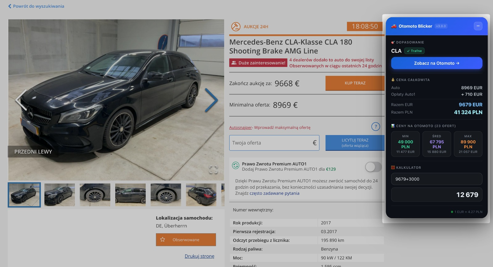

# Otomoto Blicker

  

Polski / Deutsch — dwujęzyczne README

## PL — Opis

`Otomoto Blicker` to rozszerzenie Chrome stworzone, by przyspieszyć i zautomatyzować porównywanie ofert z Auto1.com z rynkiem Otomoto (oraz — częściowo — mobile.de). Powstało, ponieważ autor tracił mnóstwo czasu na ręczne wyszukiwanie, ustawianie filtrów i liczenie marży.

Główne zalety:
- Automatyczne wyciąganie danych z oferty Auto1 (marka, model, rok, moc, przebieg, cena itp.)
- Dopasowanie do slugów i modeli Otomoto przy użyciu rozbudowanego mappingu (`otomoto_mapping.json`)
- Budowa precyzyjnego URL z filtrami (rok ±1, przebieg +40k, moc ±10 KM, paliwo, skrzynia)
- Pobieranie statystyk cen z Otomoto (min/avg/max) i przeliczanie EUR→PLN (API NBP)
- Kalkulator wyrażeń (szybkie obliczenia marży/rat)
- Obsługa trybu PL i DE (przełączalna w UI)

Ważne zastrzeżenia:
- W trybie niemieckim (`DE`) na mobile.de obecnie trzeba ręcznie wybrać markę i model — reszta powinna działać automatycznie.
- Scraper i matcher używają heurystyk — zawsze upewnij się, że dopasowanie i filtry są poprawne przed podejmowaniem decyzji.
- Opłaty AUTO1 mogą się zmieniać — w dolnej części panelu znajdziesz link do aktualnego cennika AUTO1.

## Instalacja (Chrome)
1. Sklonuj repo: `git clone https://github.com/xdynamic/auction-blicker.git`
2. Otwórz `chrome://extensions/`
3. Włącz **Tryb dewelopera**
4. Kliknij **Załaduj rozpakowane** i wskaż folder projektu
5. Otwórz dowolną ofertę na `auto1.com` (ścieżki zawierające `/car/`) — panel powinien się pojawić

## Jak korzystać
- Przełącz rynek (PL/DE) z nagłówka panelu
- Jeśli dopasowanie jest niskie: kliknij link, sprawdź i popraw filtry ręcznie na Otomoto/mobile.de
- Kalkulator przyjmie wyrażenia matematyczne (np. `40000/4.2-3000`)

## Linki i zasoby
- Aktualne opłaty AUTO1: https://content.auto1.com/static/car_images/price_list_de_2026-01-01.pdf

---

## DE — Beschreibung

`Otomoto Blicker` ist eine Chrome-Erweiterung, die dabei hilft, Angebote von Auto1.com mit dem polnischen Markt (Otomoto.pl) zu vergleichen. Der Autor hat viel Zeit verloren, indem er Filter manuell gesetzt und Preise verglichen hat — dieses Tool soll diesen Prozess automatisieren.

Hauptfunktionen:
- Automatisches Auslesen von Fahrzeugdaten auf Auto1
- Abgleich zu Otomoto-Modellen via `otomoto_mapping.json`
- Erstellung präziser Such-URLs (Baujahr ±1, Laufleistung +40k, Leistung ±10 PS)
- Sammeln von Preisstatistiken (min/avg/max) und EUR→PLN Umrechnung via NBP
- Integrierter Taschenrechner für Margen/Rechnungen
- Umschaltbar zwischen polnischem und deutschem Modus

Wichtige Hinweise:
- Im deutschen Modus (`DE`) auf mobile.de muss derzeit Marke/Modell manuell gewählt werden; ansonsten arbeitet das Tool automatisiert.
- Scraping- und Matching-Algorithmen sind heuristisch — überprüfe immer Ergebnisse und Filter.
- AUTO1-Gebühren können sich ändern — unten im Panel ist ein Link zur offiziellen Gebührenliste.

## Installation (Chrome)
Siehe Abschnitt „Instalacja“ (oben) — gleiche Schritte.

---

## Status
Projekt jest aktywnie rozwijany. Zdecydowanie zalecane jest manualne potwierdzenie dopasowania i filtrów przed podjęciem decyzji zakupowych. Nie polegaj na 100% automatyce, zwłaszcza w przypadku opłat i filtrów.

Jeśli chcesz, mogę przygotować PR z dodatkowymi testami jednostkowymi dla `matcher.js` i `fee-calculator.js`.

---

MIT © 2026

