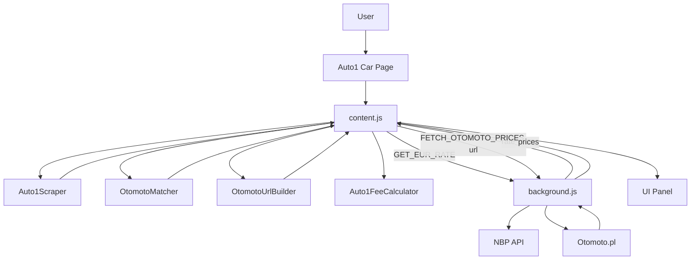

# Audyt projektu Otomoto-Blicker

Pełny audyt rozszerzenia przeglądarki (v3.0) z naciskiem na jakość kodu, potencjalne błędy, wydajność i rozszerzalność.

---

## 1. Architektura i przepływ danych

### 1.1. Manifest i punkty wejścia

- **Manifest (MV3):** `src/background.js` jako service worker (module), content scripts tylko dla `https://*.auto1.com/*/merchant/car/*`.
- **Content scripts** ładują w kolejności: `helpers.js` → `scraper.js` → `matcher.js` → `url-builder.js` → `fee-calculator.js` → `content.js`, plus `src/ui/styles.css`.
- **Uwaga:** W `content.js` warunek to `pathname.includes('/car/')`. Manifest wymaga `/merchant/car/`. Jeśli Auto1 ma też ścieżki typu `https://auto1.com/car/...` (bez `merchant`), rozszerzenie tam się **nie** wstrzyknie. Warto ujednolicić: albo rozszerzyć `matches` w manifest o `*://*.auto1.com/*/car/*`, albo potwierdzić, że w praktyce używane są wyłącznie URL-e z `merchant`.

### 1.2. Przepływ krok po kroku

1. Użytkownik wchodzi na stronę ogłoszenia Auto1 (`/merchant/car/...`).
2. Content script się ładuje; `content.js` sprawdza `/car/` i obecność `Auto1Scraper`.
3. `loadData()` równolegle pobiera `otomoto_mapping.json`, `data/auto1_fees_2026.json` oraz (przez messaging) kurs EUR z backgroundu.
4. Wyświetlany jest szkielet panelu (`renderLoadingPanel`).
5. `waitForElement('.ctaBar__name, .car-info-title', 10000)` czeka na elementy strony.
6. `Auto1Scraper.scrape()` zbiera z DOM: tytuł, dane techniczne, cenę, lokalizację.
7. `OtomotoMatcher.match(make, title)` zwraca slug modelu Otomoto (lub `null`).
8. `OtomotoUrlBuilder.buildWithRanges(...)` buduje URL listingu Otomoto z filtrami.
9. `Auto1FeeCalculator.calculate(...)` liczy opłaty; `calculateTotalPrice` i `convertToPln` dają sumę w EUR i PLN.
10. Content wysyła do backgroundu `FETCH_OTOMOTO_PRICES` z wygenerowanym URL; background fetche’uje HTML Otomoto, parsuje ceny i zwraca statystyki (min/avg/max/count).
11. `renderPanel(...)` buduje końcowy panel i podłącza kalkulator oraz przycisk minimalizacji.

Dane w content script: wszystko w pamięci (mapping, fees, kurs EUR z backgroundu). W backgroundzie: kurs EUR/PLN w `chrome.storage.local` z TTL 1 h.

### 1.3. Diagram przepływu

---

## 2. Analiza modułów – jakość kodu i potencjalne błędy

### 2.1. `src/content.js`

**Struktura:** IIFE z `main()`, `loadData()`, `renderLoadingPanel()`, `renderPanel()`, `setupCalculator()`, `fetchPricesFromOtomoto()`, helpery `fmtPln`/`fmtEur`.

**Problemy i ryzyka:**

- **Brak obsługi `fees === null`:** `feeCalculator.calculate(carLocation, 'DE', ...)` zwraca `null`, gdy `buyerCountry` nie występuje w `data/auto1_fees_2026.json` (np. gdy `normalizeCountry` zwróci kod spoza listy). Wywołanie `feeCalculator.calculateTotalPrice(carData.priceEur, fees)` i potem `data.fees.total` w `renderPanel` doprowadzi do błędu. **Rekomendacja:** Przed użyciem `fees` sprawdzać `if (!fees)` i wtedy pokazać komunikat / wartości domyślne lub użyć fallbacku (np. DE).
- **Stały `buyerCountry: 'DE'`:** Drugi argument `calculate()` jest na sztywno `'DE'`. Opłaty są więc zawsze dla kupującego z Niemiec. Jeśli docelowo kupujący może być z PL/AT itd., trzeba przekazywać kraj kupującego (np. z ustawień lub wykrycia).
- **Brak walidacji `carData.priceEur`:** Przy nieudanym scrapingu ceny `priceEur` może być 0. Panel i tak pokaże „0 EUR” i opłaty. Można dodać informację typu „Cena nie odczytana” gdy `priceEur === 0`.
- **Długie funkcje:** `renderPanel` i `setupCalculator` są duże (HTML w stringach, logika kalkulatora). Trudniej je testować i utrzymywać. Warto wydzielić budowę HTML do szablonów/funkcji oraz osobną logikę ewaluacji wyrażeń kalkulatora.
- **Obsługa błędów:** `main().catch(error => Helpers.error(...))` zapobiega nieobsłużonym wyjątkom, ale użytkownik widzi tylko pusty/loading panel. Warto po błędzie wyświetlić w panelu krótki komunikat (np. „Nie udało się załadować danych”).

### 2.2. `src/core/scraper.js` (Auto1Scraper)

**Selektory i heurystyki:**

- Tytuł: `.ctaBar__name span`, `.car-info-title h2`, `h2.no-score`, `[data-qa-id="car-title"]` – sensowny fallback; zmiana klas/struktury po stronie Auto1 może wymagać aktualizacji.
- Cena: kombinacja regexów na `document.body.textContent` oraz selektorów `[data-qa-id="car-price"]`, `.car-price`, `.price-value`, `.ctaBar__price`, `[class*="price"]`. Ryzyko: inne elementy z „price” w klasie mogą dać fałszywe dopasowanie; próg `> 1000` ogranicza część błędów.
- Dane techniczne: iteracja po wszystkich `tr` i szukanie `td` – zależne od tabel w layoutcie Auto1.

**Parsowanie i edge case’y:**

- **Rok:** `(19|20)\d{2}` – poprawne.
- **Przebieg:** `parseInt(value.replace(/\D/g, ''))` – odporne na spacje i jednostki; przy pustym `value` wynik to `NaN`, ale przypisanie `|| 0` daje 0.
- **Pojemność:** `(\d[\d\s]*)` – może złapać tylko pierwszą grupę cyfr; formaty typu „1 984 ccm” są ok.
- **Moc:** konwersja kW→KM (×1.36); przy braku dopasowania `power` zostaje 0.
- **Cena:** usuwanie `[\s,\.]` – poprawne; przy wielu dopasowaniach z body brane jest pierwsze z wartością > 1000. Możliwy problem: liczby z wieloma separatorami (np. „1.234,56”) – obecnie nie ma obsługi formatu EU.

**NaN/undefined:** W `parseSpecRow` używane jest `parseInt(…) || 0`, więc brak `NaN` w polach numerycznych. `scrapePrice` ustawia `priceEur` tylko przy sensownym dopasowaniu; w przeciwnym razie zostaje 0.

**Rekomendacje:** (1) Zawęzić selektor ceny (np. najpierw `data-qa-id`, potem konkretne klasy). (2) Rozważyć jeden wspólny helper do parsowania liczb z tekstu (z obsługą przecinka/kropki).

### 2.3. `src/core/matcher.js` (OtomotoMatcher)

**Logika:** Najpierw `findVariant` (modele z keywordami: variant, avant, touring, …), potem `findBaseModel` z scoringiem (dopasowanie labela, specjalne reguły dla Mercedes/BMW/Audi/Volvo).

**Warianty tytułu:** Normalizacja ograniczona do `title.toLowerCase()`. Warianty typu „1.0 TSI” vs „1.0TSI” są obsługiwane przez `titleLower.includes(labelLower)` i rozbicie sluga na części. Brak jawnej normalizacji spacji/ kropek w tytule – przy bardzo innym zapisie (np. „TSI 1,0”) dopasowanie może nie zadziałać.

**Fallback:** Gdy brak dopasowania, zwracane jest `null`; w `content.js` ustawiany jest obiekt z `slug: ''` i URL tylko do marki – OK.

**Wydajność:** Dla każdej marki iteracja po `Object.entries(models)` w `findVariant` i ponownie w `findBaseModel` (z sortowaniem po długości labela). Dla marek z dziesiątkami modeli to nadal O(n); przy bardzo dużym mappingu można rozważyć indeks (np. mapowanie znormalizowanych fragmentów na slugi), ale na obecny rozmiar to nie jest krytyczne.

**Rozszerzalność:** Dodanie nowej marki/modelu to edycja JSON; nowe reguły (np. „Seria X”) wymagają zmian w `findBaseModel`. Struktura na to pozwala.

### 2.4. `src/core/fee-calculator.js` (Auto1FeeCalculator)

**Wybór cennika:** `this.fees.countries[buyerCountry]` – brak kraju w JSON → `null` i wczesny return. Caller musi to obsłużyć (w content.js obecnie nie ma – patrz wyżej).

**Obliczenia:**  
Handling (krajowy / cross-border), documents, opcjonalnie transport (tylko DE ma `transport` w JSON), opcjonalnie drugi zestaw kół, auction fee = 0 z notą. VAT z `getVatRate(buyerCountry)`. Dla krajów spoza słownika VAT domyślnie 20%.

**Edge case’y:**  
- Brak `countryFees.transport` (np. PL) – warunek `options.includeTransport && countryFees.transport` chroni przed błędem.  
- `calculateTotalPrice(carPriceEur, fees)` zakłada, że `fees` ma `.total` – przy `fees === null` będzie błąd; to należy naprawić w content.js.

**Nowy rok/kraj:** Dodanie nowego pliku JSON (np. `auto1_fees_2027.json`) lub nowego kraju w obecnym pliku i ładowanie go w content.js – struktura na to pozwala. Warto w jednym miejscu (np. stała w content.js) trzymać nazwę pliku cennika, żeby nie hardkodować w wielu miejscach.

### 2.5. `src/core/url-builder.js` (OtomotoUrlBuilder)

**Parametry:** yearFrom/To (rok ±1), mileageTo (przebieg + 40 000), paliwo, skrzynia, moc (±10 KM), `damaged=0`, sortowanie po cenie.

**Paliwo:** Mapowanie z wartości z Auto1 na slugi Otomoto (petrol, diesel, hybrid, electric, lpg, ethanol). Niezidentyfikowane trafia do `petrol`. Wartości z scrapera (np. „Benzyna”, „Diesel”) muszą po `.toLowerCase()` trafić do kluczy – w `fuelMap` są małe litery, więc jest ok.

**Brak roku/przebiegu:** `yearFrom`/`yearTo`/`mileageTo` wtedy `null` i nie trafiają do URL – Otomoto zwróci szerszy listing. To akceptowalne.

**Hybryda/elektryk:** W `fuelMap` są `hybryda`→`hybrid`, `elektryczny`→`electric`. Scraper przekazuje `fuel` jako tekst z tabeli – jeśli Auto1 używa innych nazw (np. „Elektryczny”), trzeba je dodać do mapowania lub znormalizować w scraperze.

**Stabilność URL:** Format ścieżki i parametrów (`search[filter_float_year:to]` itd.) zależy od Otomoto; zmiana po ich stronie wymaga aktualizacji.

### 2.6. `src/background.js`

**Kurs EUR:** Cache w `chrome.storage.local` z TTL 1 h. Przy błędzie fetch NBP zwracany jest stały fallback 4.3. Brak retry i brak obsługi offline (po wygaśnięciu cache użytkownik dostanie 4.3). Można dodać krótki retry i ewentualnie dłuższy TTL w storage przy braku sieci.

**Parsowanie Otomoto:** Dwie strategie: (1) regex `"price":\{"value":(\d+),` na embedded JSON, (2) regex na `<h3>` z samymi cyframi i spacjami, z przedziałem 5000–5 000 000 PLN. Zmiana struktury HTML/JSON po stronie Otomoto może wyzerować wynik. Warto wtedy zwracać np. `{ min: null, … }` zamiast `null`, żeby content mógł odróżnić „brak danych” od błędu.

**Wydajność:** Jeden fetch na żądanie; brak limitów ani kolejek. Przy szybkim przełączaniu między ogłoszeniami wiele równoległych fetchy do Otomoto – można dodać prosty debounce lub cache po URL (np. TTL 5 min).

### 2.7. `src/utils/helpers.js` i `src/ui/styles.css`

**Helpers:**  
- `formatPrice`, `formatMileage` – używają `Intl`, czytelne.  
- `normalizeCountry` – słownik + wykrywanie kodu 2-literowego; domyślnie `'DE'`.  
- `waitForElement` – MutationObserver + timeout; przy odłączeniu observera w timeout może być race (element pojawia się w tym samym momencie) – w typowym użyciu akceptowalne.  
- `debounce` jest zdefiniowany, ale nieużywany w obecnym kodzie – można usunąć lub wykorzystać (np. przy kalkulatorze).

**Styles:**  
Spójne prefiksy `.ob-*`, responsywność `@media (max-width: 600px)`, font Inter z CDN. Panel ma stałą pozycję `top: 76px` – przy innym layoutcie Auto1 może nachodzić na elementy. Brak zmiennych CSS dla kolorów – zmiana motywu wymaga edycji wielu reguł.

---

## 3. Wydajność

### 3.1. Content script (strona Auto1)

- **DOM:** `scraper` wykonuje wiele `querySelector`/`querySelectorAll` (tytuł, wszystkie `tr`, cena po selektorach, lokalizacja). Na typowej stronie to setki elementów – akceptowalne, ale przy bardzo dużej stronie można ograniczyć zakres (np. jeden kontener z danymi auta).
- **Dane:** Ładowanie dwóch JSON-ów i jeden message do backgroundu przed renderem – równoległe, bez zbędnego oczekiwania.
- **Uruchomienie:** Skrypt uruchamia się raz przy ładowaniu; brak ponownego uruchamiania przy SPA-nawigacji. Jeśli Auto1 to SPA i zmiana ogłoszenia nie przeładowuje strony, panel nie odświeży się – warto rozważyć obserwację URL (np. `MutationObserver` / `history` / `popstate`) i ponowne wywołanie `main()`.

### 3.2. Background

- **NBP:** Jedno żądanie przy pierwszym zapytaniu w ciągu godziny; cache ogranicza ruch.
- **Otomoto:** Jedno żądanie na panel; brak cache – każde otwarcie ogłoszenia = nowy fetch. Warto cache’ować odpowiedź po URL (np. 5–10 min), żeby ograniczyć ruch i czas przy powrocie do tego samego ogłoszenia.

### 3.3. Możliwe optymalizacje

- Cache wyników Otomoto w backgroundzie (klucz: URL, TTL ok. 5 min).
- W content script ewentualne zawężenie scrapingu do jednego kontenera (jeśli Auto1 ma wyraźny wrapper).
- Debounce lub throttle przy szybkim zmienianiu stron (np. przy wykryciu SPA) przed ponownym wywołaniem `main()`.

---

## 4. Rozszerzalność i jakość kodu

### 4.1. Struktura katalogów

Podział na `core/`, `utils/`, `ui/` jest czytelny. Brak warstwy „services” – komunikacja z backgroundem jest w `content.js`. Dla większej liczby akcji messagingu warto wydzielić np. `src/services/messaging.js` z funkcjami `getEurRate()`, `fetchOtomotoPrices(url)`.

### 4.2. Testowalność

- **Auto1FeeCalculator, OtomotoUrlBuilder:** Czyste funkcje/obliczenia, łatwe do unit testów (bez DOM).
- **OtomotoMatcher:** Zależny tylko od obiektu mapping – można testować z małym JSON.
- **Auto1Scraper:** Silnie zależny od DOM – wymaga JSDOM lub podobnego z fragmentem HTML Auto1; testy integracyjne lub snapshoty selektorów.
- **content.js:** Dużo logiki w jednym pliku, bezpośrednie wywołania `document.*`, `chrome.runtime` – trudne testy bez wydzielenia logiki do funkcji przyjmujących dane (np. `computePanelData(carData, mapping, fees, eurRate)`).

### 4.3. Rekomendacje refaktoryzacji

- Dodać sprawdzenie `if (!fees)` w `content.js` po `calculate()` i obsłużyć przypadek (komunikat lub fallback).
- Wydzielić z `content.js`: (1) budowę danych panelu (bez DOM), (2) szablony HTML (funkcje zwracające string lub małe komponenty), (3) messaging do backgroundu do osobnego modułu.
- Ujednolicić manifest i content: albo tylko `*/*/car/*`, albo dokumentować, że obsługiwane są wyłącznie URL-e z `merchant`.
- Usunąć nieużywany `Helpers.debounce` albo użyć go (np. przy inpucie kalkulatora).
- W backgroundzie po błędzie fetch Otomoto rozważyć zwracanie obiektu z `{ error: true }` zamiast `null`, żeby odróżnić błąd od „0 ofert”.
- W CSS wprowadzić zmienne dla kolorów/breakpointów (np. `--ob-panel-top`, `--ob-primary`).

---

## 5. Wnioski i rekomendacje

### 5.1. Mocne strony

- Czytelny podział na moduły (scraper, matcher, url-builder, fee-calculator) i konfigurację w JSON.
- Użycie MV3, storage do cache kursu, równoległe ładowanie danych.
- Rozbudowany mapping Otomoto i specjalne reguły dla Mercedes/BMW/Audi/Volvo.
- Cennik opłat w osobnym pliku JSON – łatwa aktualizacja na nowy rok.
- Spójny UI z prefiksem `.ob-*` i responsywnością.

### 5.2. Najważniejsze ryzyka i błędy

| Priorytet | Opis | Lokalizacja |
|-----------|------|-------------|
| Wysoki | Brak obsługi `fees === null` → możliwy crash przy nieznanym kraju | `content.js` po `feeCalculator.calculate()` |
| Średni | Stały `buyerCountry: 'DE'` – opłaty zawsze dla DE | `content.js` wywołanie `calculate()` |
| Średni | Manifest `merchant/car` vs warunek `pathname.includes('/car/')` – rozszerzenie może nie działać na części URL-i | `manifest.json` vs `content.js` |
| Niski | Brak informacji dla użytkownika przy `priceEur === 0` | `content.js` / `renderPanel` |
| Niski | Brak komunikatu przy błędzie w `main()` | `content.js` catch w `main()` |
| Niski | Zmiana struktury HTML/JSON Otomoto może zepsuć parsowanie cen | `background.js` `fetchOtomotoPrices` |
| Niski | Zmiana selektorów Auto1 może zepsuć scraping | `scraper.js` |

### 5.3. Roadmapa ulepszeń

**Quick wins (1–2 h):**

- Dodać `if (!fees) { … }` w content.js (fallback lub komunikat).
- W `main().catch` wyświetlić w panelu krótki komunikat błędu.
- Dodać w backgroundzie prosty cache odpowiedzi Otomoto (Map/obiekt po URL, TTL 5 min).

**Średni termin (pół dnia–1 dzień):**

- Wydzielić messaging (getEurRate, fetchOtomotoPrices) do osobnego modułu.
- Ujednolicić/dokumentować regułę URL (manifest vs `/car/`).
- Dodać opcję/ustawienie kraju kupującego i przekazywać je do `calculate()`.
- Wprowadzić zmienne CSS i ewentualnie jeden plik konfiguracyjny (np. nazwa pliku fees).

**Dalsze kierunki:**

- Obsługa SPA: wykrywanie zmiany URL i ponowne uruchomienie analizy.
- Testy jednostkowe dla fee-calculator, url-builder, matcher (Node + mały fixture).
- Rozszerzenie mappingu/fee o nowe rynki (np. CZ, SK) i wybór rynku w UI.
- Ulepszenie dopasowania modeli (np. fuzzy match, priorytety wariantów).

---

*Audyt wykonany na podstawie kodu w katalogu `src/`, `manifest.json`, `otomoto_mapping.json`, `data/auto1_fees_2026.json`.*
